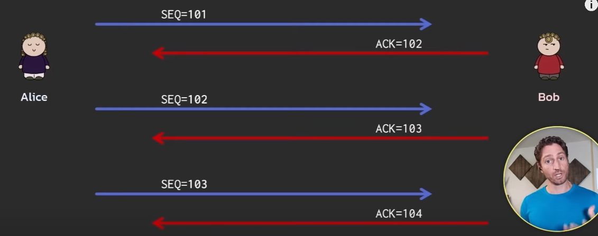
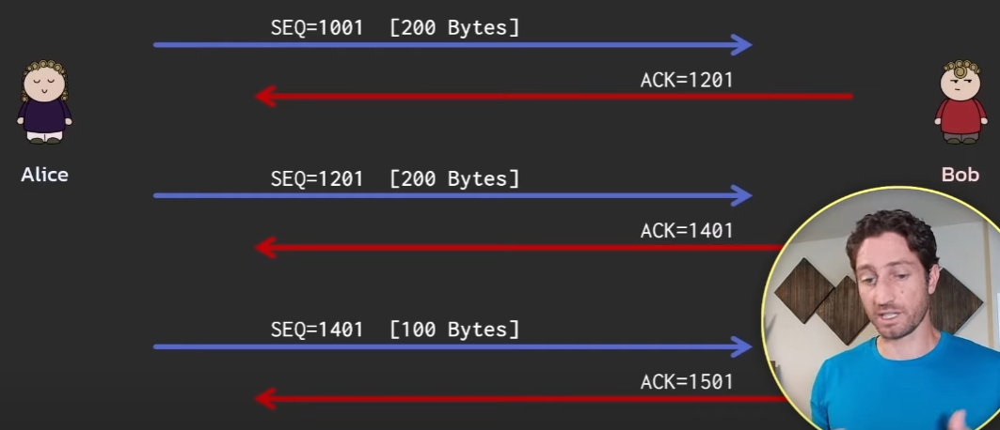
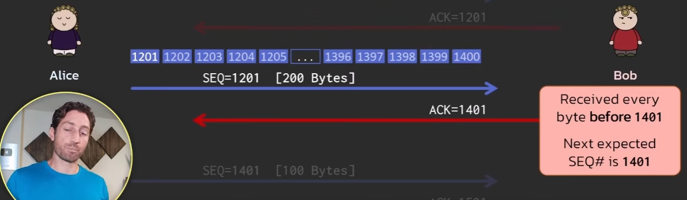
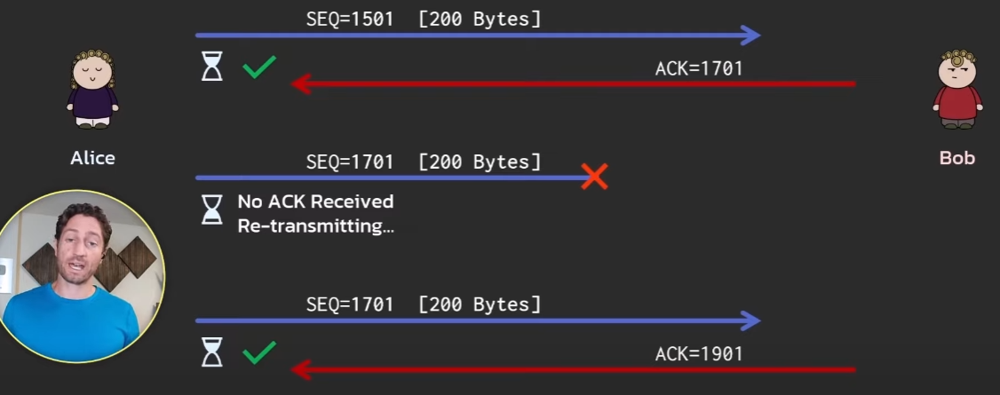
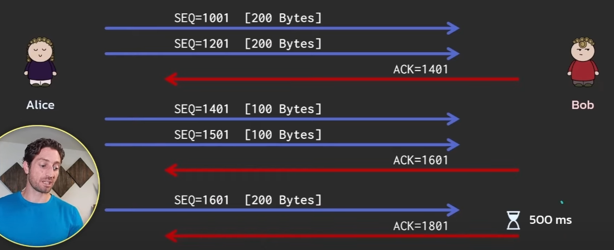
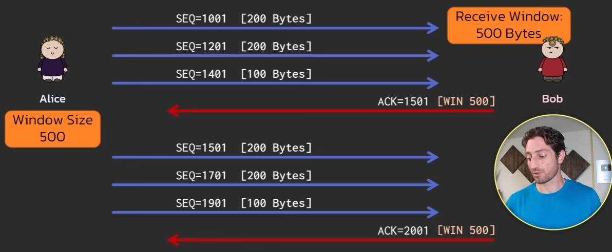
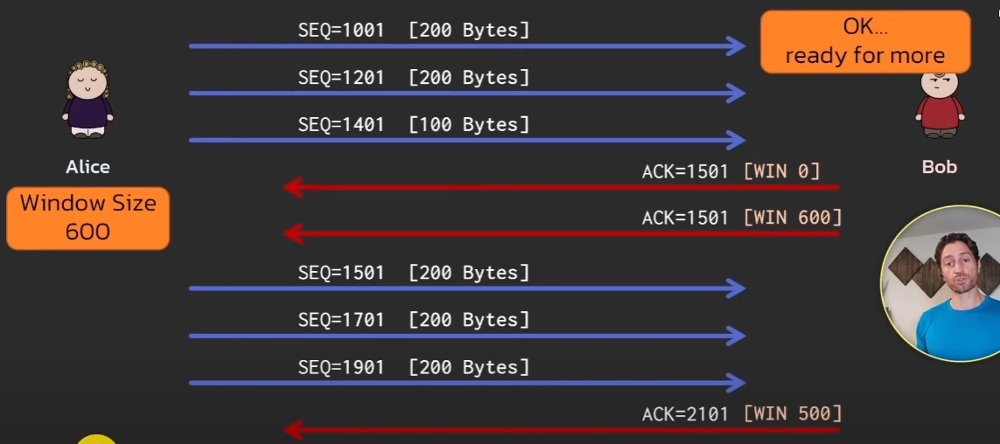
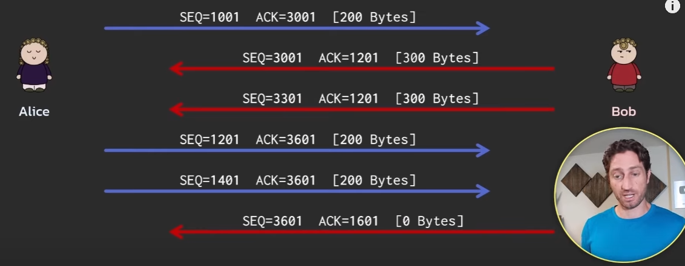
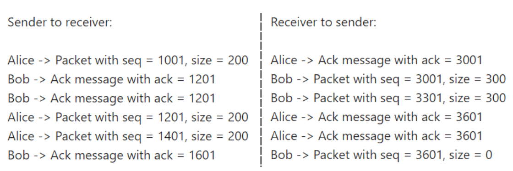

### Concept 1: Sequence Numbers and Acknowledgment Numbers

 
*Screenshot from “TCP - 12 simple ideas to explain the Transmission Control Protocol” by Practical Networking on [YouTube](https://www.youtube.com/watch?v=JFch3ctY6nE).*

Alice first sends a packet with sequence number 101 to Bob.
Bob is while replying to this packet sends the reply with acknowledgment number 102 (101 + 1).
Alice now sends another new packet with sequence number 102 (previous ack number).
Bob now sends a reply to this packet with ack number 103 (102 + 1).

So the flow is:

    Packet 1: Alice to Bob: seq = 101
    Reply to packet 1: Bob to Alice: Ack = 101 + 1

    Pakcet 2: Alice to Bob: seq = 102 (last ack)
    Reply to packet 2: Bob to Alice: Ack = 102 + 1

Now this is the basic concept behind seq and ack numbers but in actuality size of the packet is added instead of 1.

*Screenshot from “TCP - 12 simple ideas to explain the Transmission Control Protocol” by Practical Networking on [YouTube](https://www.youtube.com/watch?v=JFch3ctY6nE).*

Let's say Alice sends a new packet with seq number 1001 on it.

Flow:

Packet - 1:

+ Alice sends packet-1 with seq no. 1001 to Bob. This packet has a size of 200 bytes.
+ Bob sends confirmation reply to this packet to Alice with ack number 1201 (1001 + 200).

Packet - 2:

+ Alice sends packet-2 with seq no. 1201 (last ack no.) to Bob. This packet has a size of 200 bytes.
+ Bob sends confirmation reply to this packet to Alice with ack number 1401 (1201 + 200).

Packet - 3:

+ Alice sends packet-3 with seq no. 1401 (last ack no.) to Bob. This packet has a size of 100 bytes.
+ Bob sends confirmation reply to this packet to Alice with ack number 1501 (1401 + 100).

Interpretation of confirmation reply for a packet that was sent:

*Screenshot from “TCP - 12 simple ideas to explain the Transmission Control Protocol” by Practical Networking on [YouTube](https://www.youtube.com/watch?v=JFch3ctY6nE).*

Note: In a packet Alice sends with seq no 1201, the 1st byte is byte 1201 of the whole data we are trying to send to bob. So a packet with seq no. x means the 1st byte is byte x of the whole data.

**So for every packet we send, bob gives a reply confirming that the packet arrived properly.** Sender after receiving this acknowledgement message opens that packet to see the ack number and verify that the receiver is in sync with the bytes sent.

The ACK message contains a ack number indicating the next byte of data Bob expects to receive. This confirms to Alice that all bytes up to that sequence number have been successfully received.

### Concept 2: How TCP handles packet loss i.e. packet getting dropped on the way.

*Screenshot from “TCP - 12 simple ideas to explain the Transmission Control Protocol” by Practical Networking on [YouTube](https://www.youtube.com/watch?v=JFch3ctY6nE).*

TCP maintains a timer and a cache of the packet that was just sent. Once a packet is sent, the timer starts. If the reply ack message to the sent packet does not come before the timer runs out, then TCP i.e. Alice understands that the acknowledgment message has been dropped somewhere. So Alice sends the packet again to bob using the cache of that packet. Let's assume that this packet reaches Bob. Now Bob will send the reply (ack message) for this packet and this message will reach in time. Once this message reaches within the time then Alice throws away the cache and resets the timer.

**What if the packet reaches but the ack message gets dropped on the way to Alice?** 

This means the ack message doesn't make it within time, so Alice will have to resend the packet again using cache. So now Bob essentially receives a duplicate of the packet as it already has the original packet. Now Bob will open this duplicate packet, just as he would with any other packet and see the seq no. and notice that he has another packet with the same seq no. So Bob will drop this duplicate packet and send a acknowledgement message stating he already received this packet.

This whole process is known as retransmission and the timer that the sender maintains is known as retransmission timer.

### Concept 3: Reducing Acknowledgment packets

So far we have looked at the original framework of the TCP, whereas for every packet the sender sends, the receiver sends back an acknowledgment message. But this is not very efficient as we are increasing the data transmitted back and forth with these ack messages.

So people who created TCP came up with few methods to cut down on the amount of ack messages the receiver sends whilst still maintaining proper connection and being in sync with the packet bytes (seq no.) the sender is at.

#### Method 1: Delayed Acknowledgement

In this method, an acknowledgement message is sent for every other packet that the receiver receives from the sender.

*Screenshot from “TCP - 12 simple ideas to explain the Transmission Control Protocol” by Practical Networking on [YouTube](https://www.youtube.com/watch?v=JFch3ctY6nE).*

Packet 1:

+ Alice sends a packet with seq 1001 and size 200 bytes to bob.
+ Alice does not want for an ack message and sends another packet with seq 1201 and size 200 bytes to bob.
+ Now bob sends an ack message of ack no 1401 (1001 + 200 + 200) to the sender Alice.

Packet 2:

+ Alice sends a packet with seq 1401 and size 100 bytes to bob.
+ Alice does not want for an ack message and sends another packet with seq 1501 and size 100 bytes to bob.
+ Now bob sends an ack message of ack no 1601 (1401 + 100 + 100) to the sender Alice.

This process of sending acknowledgement for every two packets is also known as cumulative acknowledgement.

This process is handy dandy when the whole data is split into even number of packets. Throughout the end of the connection, sender would be sending two two packets to the receiver and the receiver would respond with an ack message for the 2nd packet. **Now what happens if the whole data is split into odd number of packets? Particularly what happens when we send approach the end of the connection where we have only one packet left to send to the receiver instead of two?** Does the receiver wait for the second packet to come after this last packet in order to send the ack message and does the sender keep maintaining the connection untill the final ack message arrives from the receiver?

Lucky for us, the creators of TCP thought about this and implemented another timer, this time at the receivers end. This timer (of 500ms) says that if I runout then send the ack message regardless if you have receiver one packet or two packets. So the receiver:

+ checks if the two packets have arrived from the receiver
+ If the packets have not arrived within the time of 500ms then it sends a ack message with the seq (ack) number of latest ack message + size of the latest packet to the sender.

#### Method 2: Window Size

In this method, the receiver first defines the window size (in a earlier ack message) and based on this window size, the sender keeps sending packets until the size defined gets reached. Once the sender hits this mark, it stops sending any further packets and waits for an ack message from the receiver.

Let's see an example and interpret what's happening.

*Screenshot from “TCP - 12 simple ideas to explain the Transmission Control Protocol” by Practical Networking on [YouTube](https://www.youtube.com/watch?v=JFch3ctY6nE).*

+ Bob has pre-defined the window size as 500 bytes.
+ Alice sends packet A (seq = 1001, size = 200 bytes). Updates the remaining window size to 300 bytes.
+ Alice sends packet B (seq = 1201, size = 200 bytes). Updates the remaining window size to 100 bytes.
+ Alice sends packet C (seq = 1401, size = 100 bytes). Updates the remaining window size to 0 bytes.
+ **Once Alice hits 0 on the window size, it stops preparing the next packet and waits for an acknowledgement message from Bob.**
+ Bob now sends an ack message with cumulative ack number of 1501. Bob also defines the next window size to be 500 again in this ack packet.
+ Now the same process starts over again.

Receiver can set varying window size with each ack message. Let's assume that bob is a web-server and is getting requests from not only Alice but from others as well. If Bob fells overwhelmed by the packets he keeps getting from others, he can stop Alice to send packets for a while and focus on the requests of others and then deal with Alice.

*Screenshot from “TCP - 12 simple ideas to explain the Transmission Control Protocol” by Practical Networking on [YouTube](https://www.youtube.com/watch?v=JFch3ctY6nE).*

+ Let's say Bob is overwhelmed during the packet c (seq = 1401, size = 100) arrival. So instead of sending ack message (ack = 1501, win = 500), bob can send ack message (ack = 1501, win = 0) to Alice.
+ **Once Alice receives this ack message and opens it and sees the window size to be 0, she will stop what she's doing and wait for another ack message from Bob.**
+ Now after Bob deals with the other people's requests, Bob will send another ack message (seq = 1501, win = 600) to Alice.
+ Now Alice can continue segmenting packets and sending them to Bob until the window size runs out again.
+ Notice in the last ack message, bob has reduced the window size to 500.

**This varying of window size by the receiver is what makes TCP achieve flow control.**

### Concept 4: TCP is Bidirectional

So far we have seen that seq packets is sent by the sender and ack message (for the arrived packets) is sent by the receiver. Now we are introducing the concept of receiver sending syn packets and receiving ack messages from the sender.

*Screenshot from “TCP - 12 simple ideas to explain the Transmission Control Protocol” by Practical Networking on [YouTube](https://www.youtube.com/watch?v=JFch3ctY6nE).*

Flow:

*Screenshot from “TCP - 12 simple ideas to explain the Transmission Control Protocol” by Practical Networking on [YouTube](https://www.youtube.com/watch?v=JFch3ctY6nE).*

### Credits:

This blog post is inspired by the video "TCP - 12 simple ideas to explain the Transmission Control Protocol" by Practical Networking on Youtube. You can watch the original video [here](https://www.youtube.com/watch?v=JFch3ctY6nE).
