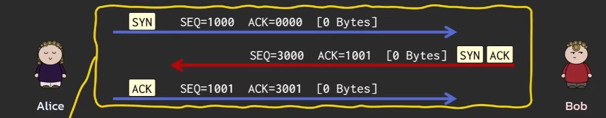
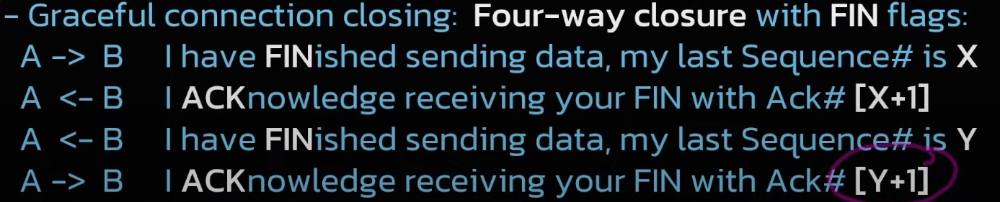
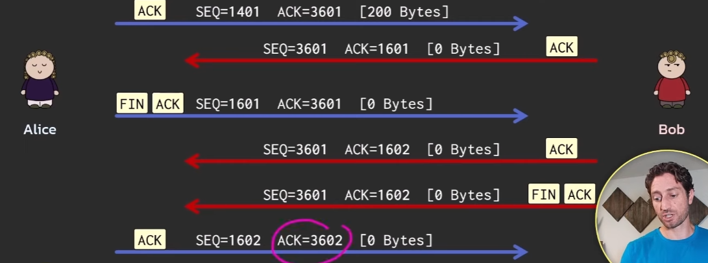
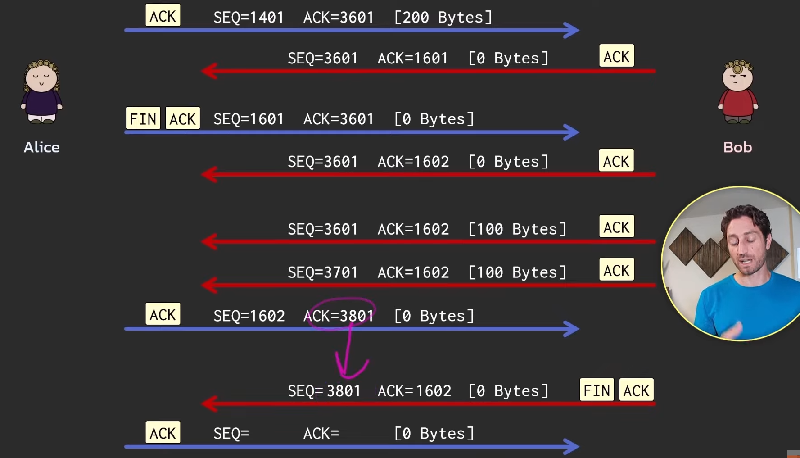
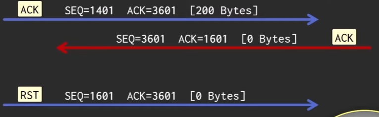

Data that we send from one device to another, whether it is a request to a web server, uploading a file to server, all of this is not done in one single go. Data involved here are divided into small small packets and then sent to the receiving device. Even a small GET request is segmented into packets and sent to the web-server. The web-server upon receiving these packets will put all of them back together, to understand the full request. Lets look at how connection is established between the client and the server inorder to facilitate data transfer in TCP.

### Three way Handshake

The very first thing that happens when two devices (sender and receiver) wants to establish a TCP connection, it is started with the three way handshake.

1. Sender first reaches out to the receiver with a synchronize SYN message. This message has an initial SN number X which is randomly generated by the sender.
2. Receiver upon receiving this SYN message, now sends an acknowledgement ACK message with ACK number = X + 1
3. Receiver, in the same packet with the ACK message, also sends out a SYN message with random ISN Y. This message is sent out to establish connection from the receiver side to the sender.
4. Sender upon receiving the packet having both ACK and SYN messages, sends out an ACK message with ACK = Y + 1, in reply to the SYN message from the receiver.

*Screenshot from “TCP - 12 simple ideas to explain the Transmission Control Protocol” by Practical Networking on [YouTube](https://www.youtube.com/watch?v=JFch3ctY6nE).*

#### SYN messages:

+ SYN message is the starting message that a sender sends out to the receiver to try and establish a connection with the receiver.
+ This message is the starting point for the seq number in the connection.
+ The initial seq number (ISYN no.) is randomly generated by the sender.
+ The size of this packet is 0 bytes. This is known as **phantom byte** because in the ACK message to this SYN message, the ack = ISYN + 1, even though the size of the SYN message is 0.

Things to note:
+ We can recognize whether a message is SYN or not by looking at the flags section in TCP part of the packet. If a 1 is next to SYN, it means the message is a SYN message.
+ **The SYN message will also have an ack number, even though it is the very first message we send to the receiver. This number can be disregarded as it is not an ACK message.**

#### ACK messages:

+ This is the reply message to a SYN message or any normal ACK message.
+ This message confirms that the receiver has received the packet(s) sent before.
+ **If a message is ACK, it means we have to consider the ack number sent in the packet's TCP part.**
+ We can recognize whether a message is ACK or not by looking at the flags section in TCP part of the packet. If a 1 is next to ACK, it means the message is a ACK message.

Note:
+ A message can be of multiple types at the same time. It can be a SYN message as well as an ACK message or it can be an ACK and PSH message at the same time. We can see the type of the message at the flags section under TCP part of the packet.
+ Every message after the three way handshake will be an ACK message (along with another type at times, but ACK is constant).

### Closing a TCP connection

So far we have seen how the middle portion (cumulative, sliding window) and starting portion (three-way handshake) of TCP looks like. Now let's see how TCP ends a connection.

TCP has two ways to end a connection:

#### FIN messages (Graceful way)

FIN messages are used to end a connection if very thing went well between the sender and receiver. Went well means sender has sent all the whole data it initially planned to send to the receiver properly and the receiver has also sent the data from its side to the sender properly.

TCP is this case, implements a four-way closure between the sender and receiver to end the connection.

*Screenshot from “TCP - 12 simple ideas to explain the Transmission Control Protocol” by Practical Networking on [YouTube](https://www.youtube.com/watch?v=JFch3ctY6nE).*

Connection has to be closed from both the sides (sender and receiver) in order to fully close the connection.

**Example 1:** Both the sender and receiver closes the connection sequentially (next next)

*Screenshot from “TCP - 12 simple ideas to explain the Transmission Control Protocol” by Practical Networking on [YouTube](https://www.youtube.com/watch?v=JFch3ctY6nE).*

Here the first two messages are:

Sender -> Final packet it intends to send, with seq = 1401, size = 200.
Receiver -> Ack message for this packet with ack = 1601

Now let's breakdown the closing of the connection that is done here.

Flow:

**Sender to Receiver:**

Sender -> FIN with seq = 1601, size = 0

This seq number is the
+ number of the last byte in the final packet it sent out, i.e. the seq number + size in the final packet
+ or the ack number in the last ack message the sender received

Receiver -> ACK with ack = 1601 + 1 = 1602

This message implies that the FIN message was received by the receiver and agrees to close the connection.

**Receiver to Sender:**

Here the last packet the receiver sent out before closing the connection is the ack message it sent out for the final packet of the sender.

Receiver -> FIN with seq = 3601, size = 0
Sender -> ACK with ack = 3602

This message implies that the FIN message was received by the sender and agrees to close the connection.

Note: Notice that the **phantom byte** has happened again while closing the connection.

**To think: Why does the phantom byte exist?**

**Example 2:** Sender closes the connection with the receiver first, receiver still maintains the connection to finish sending it's data to the sender, and later on closes the connection with the sender.

*Screenshot from “TCP - 12 simple ideas to explain the Transmission Control Protocol” by Practical Networking on [YouTube](https://www.youtube.com/watch?v=JFch3ctY6nE).*

#### RST messages (Ungraceful way)

This is the alternative way to close a connection. Let's brief overview of this concept is,

Sender's POV:

Lets say the sender sent out a packet (ACK message) with seq = 100 and size = 20. Logically the ACK message to this packet should be having seq = 120. But the receiver sends the ack message with seq = 1203 (a completely bizarre and left field number). Now the sender will look at the ACK message from the receiver and go hmm... the ack number is really strange, let me abruptly end the connection to the receiver. To end the connection, the sender will send a RST message with seq = 100 to the receiver. Once the sender sends this RST message it will forget everything about the receiver (seq no, ack no, window size left, whole data left to send) and close the connection. Once the receiver receives this RST message from the sender, it will also do the same and close the connection with the sender.

Receiver's POV:

If receiver while sending data to the sender gets a bizarre ACK message from the sender it will send a RST message to the sender and both the receiver and the sender end their connection.

Note: RST messages are unacknowledged. They only need to be sent by one of the parties involved to close both the connections (sender-receiver and receiver-sender). Hence RST messages are one way.

Example:

*Screenshot from “TCP - 12 simple ideas to explain the Transmission Control Protocol” by Practical Networking on [YouTube](https://www.youtube.com/watch?v=JFch3ctY6nE).*

### Credits:

This blog post is inspired by the video "TCP - 12 simple ideas to explain the Transmission Control Protocol" by Practical Networking on Youtube. You can watch the original video [here](https://www.youtube.com/watch?v=JFch3ctY6nE).