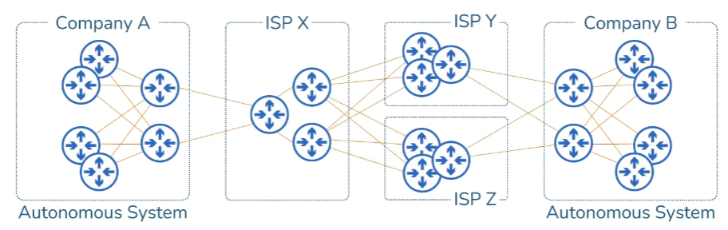
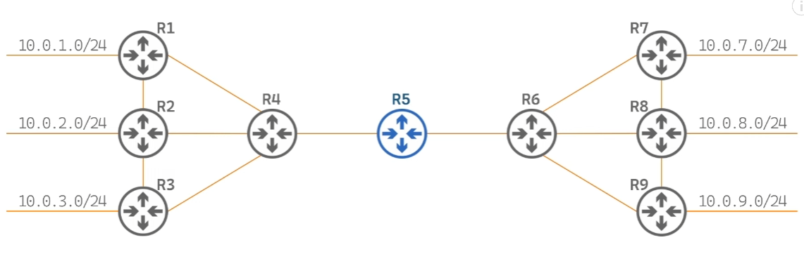

There are three ways to populate a routing table in a router.

1. Directly connected routes
2. Static routes
3. Dynamic routes

Dynamic routing means the routers share all the routes they have to other routers and vice versa and populate the routing table with routes they learn from other routers. 

To do this, routing protocols are configured between two interfaces that connect two routers. Each interface is set with the same routing protocol.

There are 5 prominent routing protocols and they are classified into two broad types:

1. Interior Gateway Protocol - RIP, OSPF, IS-IS, EIGRP
2. Exterior Gateway Protocol - BGP

IGP protocols are used within one autonomous system. The routers interconnected within these networks are configured with IGP protocols to share and learn routes from other routers.

EGP protocols are used when we connect from one autonomous system to another. Routers that are interconnect between two autonomous systems are configured with EGP protocol to share and learn routes from their neighboring routers.

Note: An autonomous system is a set of networks and routers under a single administrative control. Example: Whole network of a company, organization etc.

*Screenshot from “EGP / IGP :: Distance Vector / Link State :: Dynamic Routing Protocols :: OSPF EIGRP BGP RIP IS-IS” by Practical Networking on [YouTube](https://www.youtube.com/watch?v=KjNYEzEBRD8).*

Usually two companies do not directly share routes with each other. There is a middle man involved. This is usually ISPs. So the edge routers in these two companies and the routers in the ISPs are configured with EGP protocols. In EGP, BGP is the only protocol that is currently in use in the internet.

Other differences between IGP and EGP protocols:

1. IGP protocols are more talkative. This means routers within a company keep on sharing their routes to other routers more frequently than EGP. This is done to alert other routers if there is a change in the topology. EGP protocols on the other hand are less talkative. They limit the routers in sending route updates to other routers. This is done because, 

In a company, one would want the routers to constantly know the status of the topology i.e. whether the current routes in it are valid, has a router gone down etc. In the internet, we do not need to know the minor failures (router going down in an AS) to all the routers. Because these minor failures can happen concurrently in thousands of ASs so the internet would be flooded with this information. So to avoid this, EGPs wantedly limit the frequency of sharing routes between routers.

2. IGP has faster convergence times compared to EGP. This is because IGP is used within a comparatively smaller network when compared to EGP.

Convergence time:

*Screenshot from “EGP / IGP :: Distance Vector / Link State :: Dynamic Routing Protocols :: OSPF EIGRP BGP RIP IS-IS” by Practical Networking on [YouTube](https://www.youtube.com/watch?v=KjNYEzEBRD8).*

Imagine the link between router 1 and router 4 goes down. Router 5 would get to know that this link is down. So it has to figure out another way to send traffic destined to 10.0.1.0 network. So router 5 will eventually figure out that it can pass the packet to R4 and R4 can send it to R2 and R2 can send it to R1 and R1 can take care from there. The time taken to recognize failure in a route and provide an alternate route to this dest network is called convergence time.

### Credits:

This blog post is inspired by the video "EGP / IGP :: Distance Vector / Link State :: Dynamic Routing Protocols :: OSPF EIGRP BGP RIP IS-IS" by Practical Networking on Youtube. You can watch the original video [here](https://www.youtube.com/watch?v=KjNYEzEBRD8).