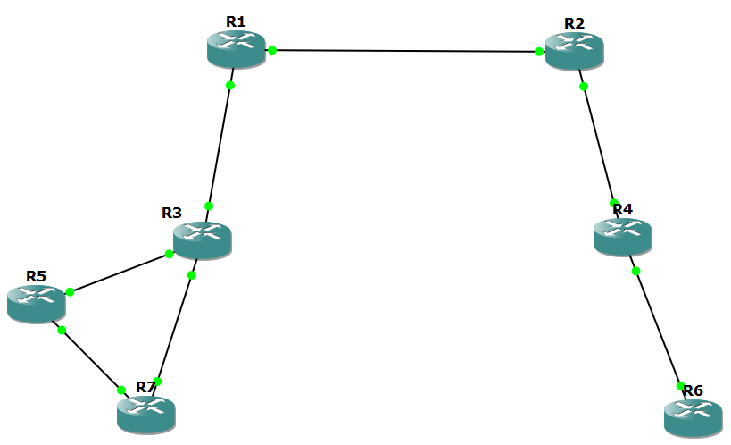
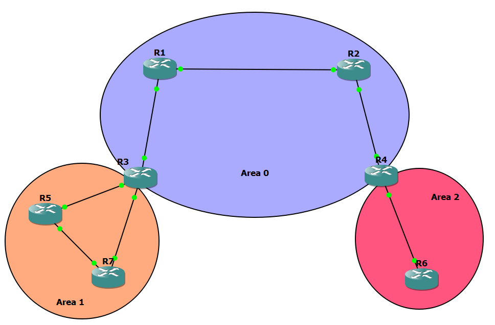

Assume that all the routers in this topology are configured with ospf and all of them have adjacency with all the routers. Now let's say router R3 wants to reach R5, let will take the directly connected route to reach R5. Now something happens and the link between R3 and R5 goes down. So R3 now will recalculate and find out that it can reach R5 by R3 > R7 > R5 path. (I think it uses LSAs in the LSDB and finds the next best shortest path to R5). Now that the topology for R3 has changed, it will send a Link State Update (LSU) to its neighbors stating the change. The following chain of events takes place:

+ R1 will receive the LSU from R3 and update this change in its LSDB. R1 will now send a LSU to R2.
+ R2 will record the change and send a LSU to R4.
+ R4 will update its LSDB and send a LSU to R6.
+ R6 will update its LSDB.
+ R7 will receive LSU sent by R3 and make the change in its LSDB. It will then send a LSU to R5.
+ R5 will update its LSDB.

Note: It would also be possible that R5 first sends the LSU to R7 and R7 makes the changes to its LSDB and sends a LSU to R3.

Note: For every LSU a router sends to a neighbor, the neighbor will send back an LSAck confirming that it received the LSU.

Now after the propagation of LSUs from all the routers to their neighbors the LSDB for all the routers have recorded the topology change and reconverged. Now lets say that the link from R3 to R5 is back on. So now what happens? The whole process of sending LSUs from one router to another untill the LSDBs reconverge takes place. Now what happens if the link keeps flicking (turning on and off frequently). This process of sending LSUs to every router in the topology can become tedious and can consume unnecessary bandwidth.

This is where segmenting the whole topology into chunks of OSPF areas comes in handy.

For router R1, R2, R4 and R6 to get to R5 all they should know is "just reach R3, R3 will take it from there". They don't need to know the status of the links behind R3. R3 can handle the traffic from there. **So in OSPF we can divide the topology into multiple areas so that LSUs and LSAs are only propagated within an area**. So in our case R3 will not send the LSU to R1. Instead it will keep the LSU within Area 1 and send it to R7.

